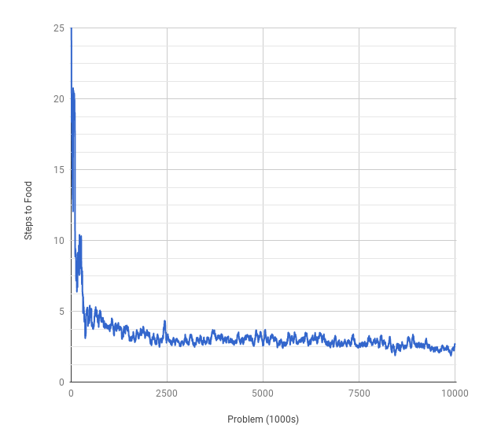
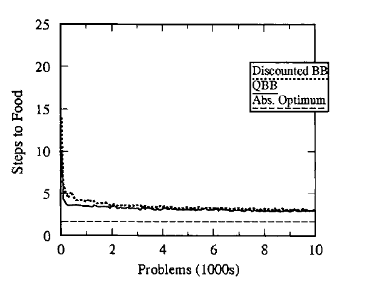
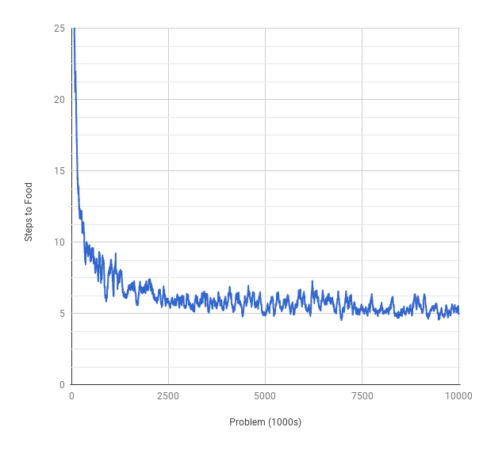
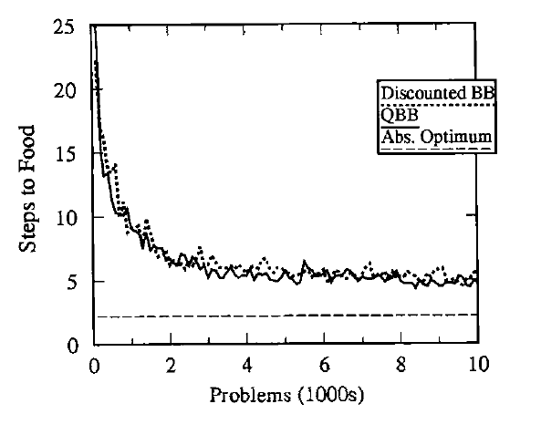

# java-zcs
Java implementation of a simplified strength based learning classifier system

This implementation of ZCS was first written in 2005 during my PhD, and revised/revived in 2017. If you catch any bugs, let me know!

## Background

[Learning classifier systems (LCS)](https://en.wikipedia.org/wiki/Learning_classifier_system) are unsupervised rule based machine learning systems. The system is comprised of many condition-action rules called classifiers, these classifiers compete to receive credit within the LCS. The classifier system receives input from its environment whereby the population of known classifiers is scanned for those whose condition part matches the current environment state. A selection mechanism determines which of the candidate classifiers becomes active, and the action of the active classifier is executed. When reard is received from the environment the LCS distributes credit to reinforce the classifiers that advocated the action. In addition to reinforcing classifiers the LCS has a discovery component (usually a genetic algorithm) which is used to discover new credit worthy classifiers. The genetic algorithm favors stronger classifiers using a roulette wheel selection policy.

The ZCS is documented in
+ [Stewart W. Wilson, ZCS: A Zeroth Level Classifier System, Evolutionary Computation, vol 2:1, pg 1 - 18, 1993](http://www.eskimo.com/~wilson/ps/zcs.pdf).

ZCS has been extended/implemented/used/discussed in

+ [Bull, L. (1999) On using ZCS in a Simulated Continuous Double-Auction Market. In W. Banzhaf, J. Daida, A.E. Eiben, M.H. Garzon, V. Honavar, M. Jakiela & R.E. Smith (eds) GECCO-99: Proceedings of the Genetic and Evolutionary Computation Conference. Morgan Kaufmann, pp83-90.](http://www.cs.bham.ac.uk/~wbl/biblio/gecco1999/GA-806.pdf)
+ [Dave Cliff and Susi Ross, Adding temporary memory to ZCS, Adaptive behavior Volume 3, Issue 2, 1994, Pages: 101 - 150](http://journals.sagepub.com/doi/pdf/10.1177/105971239400300201)
+ [ZCS Redux, Larry Bull and Jacob Hurst, Evolutionary Computation, Vol. 10, Issue 2 - Summer 2002, pp. 185 - 205](http://www.mitpressjournals.org/doi/abs/10.1162/106365602320169848?journalCode=evco)
+ [Applications of Learning Classifier Systems, Larry Bull](http://www.springer.com/gp/book/9783540211099)


In the original publication the ZCS was tested on several maze problems. The idea was to have an animat controlled by a ZCS pursue food (payoff) by sensing its position (the environmental condition) and taking a move toward the food (reward). There are two problems, Woods1 and Woods2.


## Running the code
### Prequisites
You need Maven, javac, git, and java on your path.
```
where javac java git mvn
```
Do:
```
git clone https://github.com/tofti/java-zcs.git
cd java-zcs 
mvn package
java -cp target/java-zcs-1.0-SNAPSHOT.jar com.tofti.zcs.WoodsProblem ./resources/woods1.problem
```
There are two problem files, woods1.problem and woods2.problem. The parameters in the problem files are self explanatory with ZCS parameters specified as you would expect (check Wilson's paper for details). Setting debug.zcs to true will output (a lot) of debug information to a text file. moving.avg specifies the moving average applied to the steps to food measure for each problem. Example problem file:

```
runs=100
woods.problems=10000
woods.mapfile=woods1.txt
debug.zcs=false
moving.avg=50
condition.length=16
action.length=3
classifiers=400
p=0.33
s=20.0
beta=0.2
gamma=0.71
tau=0.1
chi=0.5
mu=0.002
rho=0.125
phi=0.5
```

### Output
At the end of the runs a CSV file is output with two columns for each run containing the moving average, and the number of steps to food. A woods population file is also produced which shows the final population of classifiers for each run (#todo).

A optional woods map file maybe specified, if no value for woods.mapfile is present the woods1 problem is assumed. Alternative map files maybe generated and specified with woods.mapfile as long as the map contains '.' (blank), 'O' (tree or rock depending on what you read), and 'F' (food), and the map is rectangular.
 
 
 ## Results
 ### Woods 1
 ```
.....
.OOF.
.OOO.
.OOO.
.....
```




 ### Woods 7
 ```   
 ...........O.........................OO.........O.........
 .OFO.......F........F.........O.......F.........FO........
...........O........OO.......F............................
............................O......O.........F......O.....
...F.......OFO........OFO..........F.........OO......F....
...OO..............................O..................O...
..........OO.......O........OO....................O.......
.OFO.......F.......OF........F.........OFO........F.......
..................................................O.......
...OO.......O.................O........OO.......O.........
...F.......F.......O.........FO........F........OF....OFO.
...........O.......OF.....................................
..O......................O............O......O.......O....
..F.......F...............F..........FO.......F......OF...
..O.......OO...............O...................O..........
.....................O.....................O..............
...F........OFO......F..........F.........F......OF.......
...OO................O..........OO.......O.......O........
```




## TODO
+ Implement more targeted genetic algorithm, only classifiers that have participated in a significant number of action sets [A] should be eligible for the genetic algorithm.
+ Create tools to analyze and compact rulesets.
